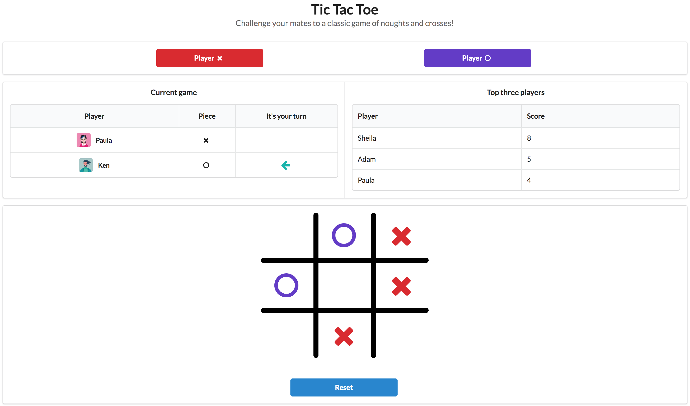

# Tic Tac Toe Web Application


## Introduction
This is a full stack application that records players, enables matches between two players at a time and keeps the scores of all entered players.


## Getting started
Clone down this repository to your local drive.
This repo assumes that node and nodemon are already installed on your local drive.
If not, run:
```
sudo npm install -g
sudo npm install nodemon -g 
```

### Installing dependencies
The prescribed dependencies needed are listed in the package.json file of this repo. After cloning this repo to your local drive, run this command in the terminal from within the root directory:
```
npm install
```


## Database usage
This application uses a PostgreSQL database to store user information saved from the web interface.
If PostgreSQL is not installed on your app, run the following command in the terminal:
```
brew install postgres
```
To create the `tictactoe` database locally, run the below script:
```
npm run resetDb
```


## Running the server
Running the server locally will include running the development configuration.
In order to run this server locally, a script called `server-dev` is inlcuded in the package.json file. Therefore run the below and await the build to complete in the terminal:
```
npm run server-dev
```
Then navigate to `http://localhost:5000/` in the web browser.


## Playing the game
1. Enter a player username for player 'X' and another for player 'O'. This can be a new username or an existing username if entered in the past.
2. Once the two players are entered, take it in turns to play the game.
3. At the end of the game hit the 'Reset' button to play another game.


## Tech stack
* React
* Node
* Express
* PostgreSQL

### Additional tools
* Webpack (production and development)
* Babel
* Eslint (AirBnB config)
* React Hot Loader (dev)


## Preview
<p align="center">
  
</p>


## Running tests
There are client side tests and server side tests.
These can be run using the `test` script, or `test:update` if you need to update snapshots.
```
npm run test
```


## Author
Preda A